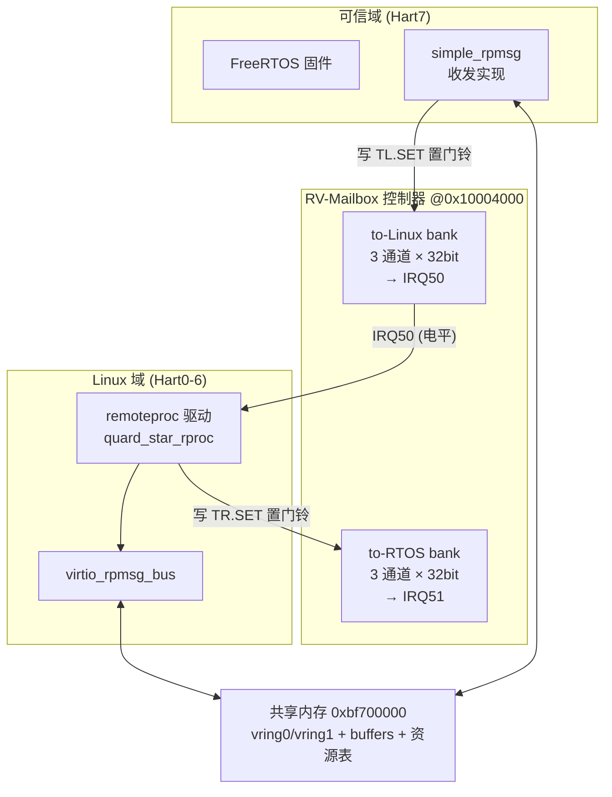
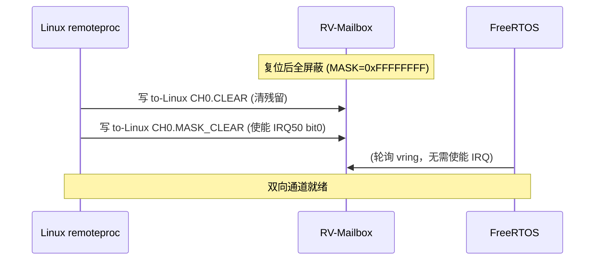
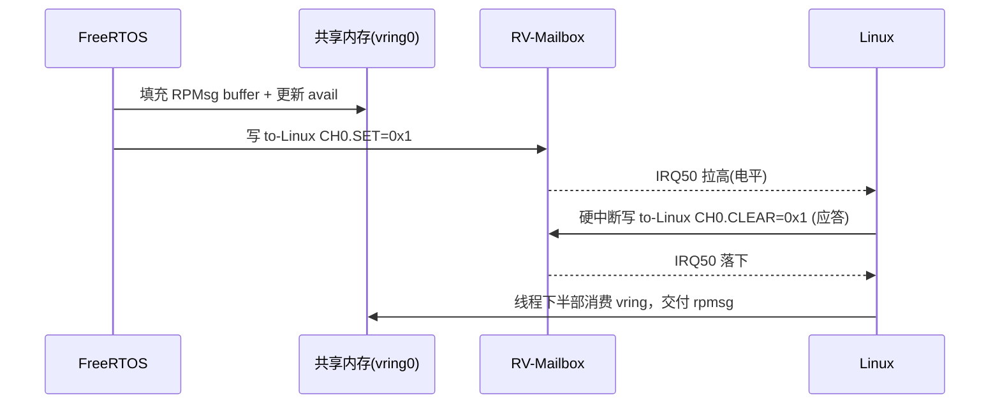
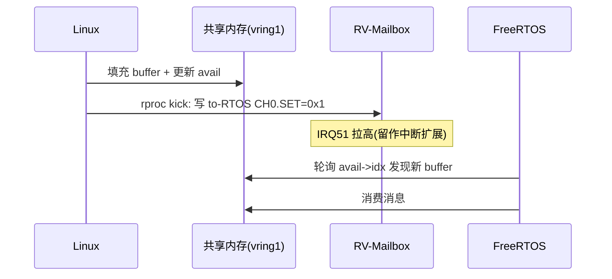

# RV-Mailbox 多核邮箱控制器及驱动软件 V1.0
## 软件设计说明书（软件著作权登记附件）

---

| 项目 | 内容 |
|---|---|
| 软件全称 | RV-Mailbox 多核邮箱控制器及驱动软件 |
| 软件简称 | RV-Mailbox |
| 版本号 | V1.0（IP 修订号 REVISION = 0x0100） |
| 开发完成日期 | 2026 年 6 月 |
| 开发语言 | C 语言 |
| 运行平台 | RISC-V 64 位异构多核（QEMU `quard-star` 虚拟样机） |
| 文档版本 | 1.0 |

> **自主开发声明**：本软件的多通道 doorbell 邮箱在**寄存器编程范式**上参考了业界典型邮箱 IP（ARM MHU v1/v2）的 SET/CLEAR/STAT + MASK 设计思想，但**全部代码由开发者自主设计与编写，与 ARM MHU 的源代码、RTL 及任何受版权/专利保护的实现均无复制或衍生关系**。本说明书描述的是开发者独立实现的代码表达。

---

## 目录

1. 软件概述
2. 运行环境
3. 软件总体架构
4. RV-Mailbox 控制器设计（核心）
5. 软件模块详细设计
6. 关键工作流程
7. 关键技术与创新点
8. 编译、部署与运行
9. 测试与验证
10. 附录（寄存器速查表 / 缩略语 / 源文件清单）

---

## 1. 软件概述

### 1.1 软件简介

RV-Mailbox 是一套面向 **RISC-V 异构多核（AMP，Asymmetric Multi-Processing）系统**的跨核通信软件，由**邮箱控制器设备模型**与配套的**多端驱动软件**组成，为运行在同一颗 SoC 不同处理器核上的两个相互独立的操作系统域提供**低延迟、可屏蔽、多通道的门铃（doorbell）式中断通知机制**，并在其上承载 VirtIO/RPMsg 消息通道，实现双向数据传输。

软件覆盖一条完整的跨核通信链路：

```
FreeRTOS（可信域，Hart7）  ⇄  RV-Mailbox 控制器  ⇄  Linux（Hart0–6，SMP）
        发送/接收侧固件              门铃+中断              remoteproc/rpmsg 驱动
```

### 1.2 开发目的与背景

在异构多核 SoC 中，一颗芯片上常同时运行实时操作系统（如 FreeRTOS，负责可信/实时任务）与通用操作系统（如 Linux，负责复杂应用）。两个域运行在不同的处理器核上、各自拥有独立的内存与中断空间，需要一种**硬件级的跨核通知原语**来触发对方的中断、并配合共享内存完成消息传递。

工业界普遍采用"邮箱（Mailbox）"IP 实现该原语。本软件实现了一款功能完备的多通道邮箱控制器，并打通了 Linux `remoteproc` + `virtio_rpmsg_bus` 框架与 FreeRTOS 侧轻量 RPMsg 实现之间的端到端通信。

### 1.3 主要功能

1. **多通道门铃通知**：双方向（to-Linux / to-RTOS）各 3 个独立通道，每通道 32 位，可承载多达 96 个独立事件位。
2. **W1S/W1C 原子读写语义**：发送方"写 1 置位"触发，接收方"写 1 清位"应答，互不干扰，避免读-改-写竞争。
3. **可屏蔽中断与电平合并**：每个事件位独立可屏蔽；同一方向多通道的有效事件合并为一根中断线（电平触发）。
4. **设备自描述**：提供 REVISION / NUM_CHANNELS / NUM_BANKS 只读寄存器，驱动可在运行时探测设备能力。
5. **多端驱动支持**：
   - QEMU 设备模型（硬件行为仿真，支持迁移快照）；
   - Linux `remoteproc` 平台驱动（attach-only 模式，承载 VirtIO/RPMsg）；
   - Linux 邮箱中断测试驱动（验证寄存器语义与中断通路）；
   - FreeRTOS 侧轻量 RPMsg 收发实现（`simple_rpmsg`）。
6. **RPMsg 双向数据通道**：在门铃之上承载 VirtIO vring，实现两域之间的字符串/二进制消息双向收发。

---

## 2. 运行环境

### 2.1 硬件环境

| 项目 | 规格 |
|---|---|
| 处理器架构 | RISC-V 64 位（RV64GC） |
| 核数 | 8 个 Hart（`-smp 8`） |
| 域划分 | Hart7 = FreeRTOS 可信域；Hart0–6 = Linux SMP |
| 邮箱寄存器基址 | `0x1000_4000`，长度 `0x1000`（4 KB MMIO） |
| 中断控制器 | PLIC（Platform-Level Interrupt Controller） |
| to-Linux 中断号 | PLIC 输入 50 |
| to-RTOS 中断号 | PLIC 输入 51 |
| 跨核共享内存 | `0xbf70_0000` 起（vring + RPMsg buffer + 资源表） |

### 2.2 软件环境

| 组件 | 版本 |
|---|---|
| 虚拟样机 | QEMU 8.0.2（自定义 `quard-star` 机器） |
| 通用操作系统 | Linux 内核 v6.10 |
| 实时操作系统 | FreeRTOS（可信域固件） |
| 引导 | 自研 BL + U-Boot 2026.01 |
| 交叉工具链 | GCC 15.2.0（riscv64-unknown-linux-gnu / -elf） |
| 构建宿主 | Ubuntu 24.04（WSL2） |

---

## 3. 软件总体架构

### 3.1 系统拓扑



### 3.2 软件组成模块

| 模块 | 所在文件 | 角色 |
|---|---|---|
| 邮箱设备模型 | `quard_star_mailbox.c/.h` | QEMU 中仿真 RV-Mailbox 硬件行为 |
| remoteproc 驱动 | `quard_star_rproc.c/.h` | Linux 侧管理远端固件 + 承载 RPMsg，kick 远端 |
| 邮箱测试驱动 | `mailbox_test.c` | 独立验证寄存器读写语义与中断通路 |
| FreeRTOS RPMsg | `simple_rpmsg.c` | 可信域侧 vring 收发 + 门铃通知 |
| 硬件规格头 | `hwspecs.h` | 可信域侧寄存器偏移定义 |

---

## 4. RV-Mailbox 控制器设计（核心）

### 4.1 设计理念

RV-Mailbox 采用"**双 bank × 多通道 × 32 位 doorbell**"的分层结构：

- **bank（方向）**：两个方向各一个寄存器组，`to-Linux`（接收方是 Linux）与 `to-RTOS`（接收方是 FreeRTOS），物理上对应两根独立中断线，从根本上隔离两个方向的通知，避免回环误触发。
- **channel（通道）**：每个 bank 内 3 个通道，可按优先级 / 业务类型（如经典的 low-priority / high-priority / secure 三分法）分流，互不阻塞。
- **doorbell（事件位）**：每通道 32 位，每一位是一个独立的"门铃"事件，可承载多达 96 个/方向的细粒度事件。

### 4.2 寄存器地址空间布局

MMIO 总长 4 KB（`0x1000`）。两个 bank 的基址与通道步长如下：

| bank | 基址（相对） | 中断线 | 通道步长 |
|---|---|---|---|
| to-Linux | `0x000` | IRQ50 | `0x20` |
| to-RTOS | `0x100` | IRQ51 | `0x20` |

每个 bank 内通道地址 = bank 基址 + 通道号 × `0x20`：

| 通道 | to-Linux | to-RTOS |
|---|---|---|
| CH0 | `0x000` | `0x100` |
| CH1 | `0x020` | `0x120` |
| CH2 | `0x040` | `0x140` |

### 4.3 通道内寄存器手册

每个通道占 `0x20` 字节，包含 6 个 32 位寄存器：

| 偏移 | 名称 | 访问 | 复位值 | 说明 |
|---|---|---|---|---|
| `+0x00` | `CHx_STAT` | RO | `0x0000_0000` | doorbell 状态，每位一个事件（1=有事件待处理） |
| `+0x04` | `CHx_SET` | W1S | — | 写 1 置位对应事件 → 可能拉高中断（**发送方写**） |
| `+0x08` | `CHx_CLEAR` | W1C | — | 写 1 清位对应事件 → 全清后中断落下（**接收方写**） |
| `+0x0C` | `CHx_MASK_STAT` | RO | `0xFFFF_FFFF` | 中断屏蔽状态（1=屏蔽该位） |
| `+0x10` | `CHx_MASK_SET` | W1S | — | 写 1 置屏蔽位（关闭该位中断） |
| `+0x14` | `CHx_MASK_CLEAR` | W1C | — | 写 1 清屏蔽位（**使能**该位中断） |

> **W1S（Write-1-to-Set）/ W1C（Write-1-to-Clear）语义**：发送方与接收方分别只对"置位寄存器"和"清位寄存器"做写操作，硬件按位 OR / AND-NOT 更新状态，天然规避读-改-写竞争——这是本设计保证多核并发安全的关键。

### 4.4 设备级寄存器（自描述）

| 偏移 | 名称 | 访问 | 值 | 说明 |
|---|---|---|---|---|
| `0x0F0` | `REVISION` | RO | `0x0100` | IP 修订号，高字节主版本.低字节次版本 = v1.0 |
| `0x0F4` | `NUM_CHANNELS` | RO | `0x3` | 每 bank 通道数 |
| `0x0F8` | `NUM_BANKS` | RO | `0x2` | bank 数量 |

驱动在 probe 阶段读取 `REVISION` 校验设备身份（期望 `0x0100`），并可读 `NUM_CHANNELS`/`NUM_BANKS` 自适应通道数量。

### 4.5 中断逻辑（电平合并）

每个 bank 的中断线电平由该 bank 内**所有通道**的"有效事件"按位或合并而成：

```
irq_linux = ( OR over ch∈{0,1,2} of ( STAT[to-Linux][ch] & ~MASK[to-Linux][ch] ) ) != 0
irq_rtos  = ( OR over ch∈{0,1,2} of ( STAT[to-RTOS][ch]  & ~MASK[to-RTOS][ch]  ) ) != 0
```

- **电平触发**：只要存在未屏蔽且置位的事件，中断线保持高电平；接收方写 `CLEAR` 清完全部相关位后，电平自动落下。
- **屏蔽优先**：被 `MASK` 屏蔽的位即使 `STAT` 置位也不参与中断合并，可用于关中断临界区或按需开关单个事件。

### 4.6 复位行为

设备复位时：

- 所有通道 `STAT = 0x0000_0000`（无挂起事件）；
- 所有通道 `MASK = 0xFFFF_FFFF`（**默认全屏蔽**）；
- 两根中断线拉低。

> **安全默认**：复位后全部屏蔽，要求接收方在初始化时**显式 `MASK_CLEAR` 使能**自己关心的事件位，避免设备就绪前的杂散中断。

---

## 5. 软件模块详细设计

### 5.1 QEMU 邮箱设备模型（`quard_star_mailbox.c`）

基于 QEMU `SysBusDevice` 实现，核心数据结构：

```c
struct QuardStarMailboxState {
    SysBusDevice parent_obj;
    MemoryRegion iomem;
    qemu_irq irq_linux;   /* to-Linux bank → PLIC 50 */
    qemu_irq irq_rtos;    /* to-RTOS  bank → PLIC 51 */
    uint32_t stat[RVMB_NUM_BANKS][RVMB_NUM_CHANNELS];  /* [bank][channel] */
    uint32_t mask[RVMB_NUM_BANKS][RVMB_NUM_CHANNELS];
};
```

关键逻辑：

- **地址解码** `qsmb_decode()`：把 MMIO 偏移解析为 (bank, channel, 通道内寄存器)，非通道区返回设备级寄存器或报 guest error。
- **写处理** `quard_star_mailbox_write()`：按 `SET/CLEAR/MASK_SET/MASK_CLEAR` 分别做 `|=`、`&=~`、置/清屏蔽，并调用 `qsmb_update_irq()`；对 RO 寄存器写入记录 guest error。
- **中断更新** `qsmb_update_irq()`：按 §4.5 公式重算指定 bank 的电平并 `qemu_set_irq()`。
- **迁移支持**：`VMStateDescription`（version_id=1）持久化 `stat`/`mask` 二维数组，支持快照/迁移。

### 5.2 Linux remoteproc 驱动（`quard_star_rproc.c`）

采用 **attach-only** 模式（远端固件由引导独立加载，Linux 仅"附着"并接管 RPMsg）：

- **vring 静态映射**：vring0（TX，`0xbf700000`）、vring1（RX，`0xbf702000`）、RPMsg buffer（`0xbf704000`）、资源表（`0xbf70c000`）按固定物理地址注册 carveout，规避 attach 模式下地址不可预测问题。
- **kick（通知远端）**：`rproc_ops.kick` 中向 `to-RTOS CH0.SET`（偏移 `0x104`）写门铃位 `0x1`，触发 IRQ51。
- **接收远端通知**：硬中断处理函数对 `to-Linux CH0.CLEAR`（偏移 `0x08`）写 `0x1` 清门铃（应答），线程化下半部驱动 vring RX。
- **probe 使能**：清一次 `to-Linux CH0.CLEAR`（`0x08`）后，写 `to-Linux CH0.MASK_CLEAR`（`0x14`）使能 bit0 中断。

### 5.3 Linux 邮箱中断测试驱动（`mailbox_test.c`）

独立验证寄存器语义与中断链路的最小驱动：

- probe 时读 `REVISION`（`0xF0`）校验为 `0x0100`；
- 写 `MASK_CLEAR` 使能 bit0，注册中断；
- ISR 读 `STAT` 判定事件、写 `CLEAR` 应答；
- remove 时写 `MASK_SET`（`0x10`）重新屏蔽，安全卸载。

### 5.4 FreeRTOS 侧 RPMsg（`simple_rpmsg.c`）

可信域侧轻量实现：

- **接收**：轮询 vring `avail->idx`（`simple_rpmsg_poll`），无需中断即可消费 Linux 投递的 buffer。
- **发送 + 通知**：填充 vring 后调用 `mailbox_kick_to_linux()`，向 `to-Linux CH0.SET`（偏移 `0x04`）写门铃位 `0x1`，触发 IRQ50 通知 Linux。
- **寄存器访问宏**（关键正确性保障）：

```c
/* offset 是字节偏移；base 必须先转字节指针再相加，
 * 否则 uint32_t* 指针运算会把偏移 ×4 导致错写寄存器。 */
#define MAILBOX_REG(base, offset) \
    (*(volatile uint32_t *)((volatile uint8_t *)(base) + (offset)))
```

---

## 6. 关键工作流程

### 6.1 初始化与中断使能



### 6.2 FreeRTOS → Linux 通知（含数据）



### 6.3 Linux → FreeRTOS 通知（含数据）



---

## 7. 关键技术与创新点

1. **方向隔离的双 bank 结构**：以独立中断线区分收发方向，从硬件层杜绝同核回环误触发，比单寄存器单中断的简易邮箱更健壮。
2. **多通道 + 32 位 doorbell 的细粒度事件空间**：单方向可表达 96 个独立事件，为多业务分流、优先级隔离预留充足空间。
3. **W1S/W1C + RO 镜像的无锁并发模型**：发送/接收方各写独立寄存器，硬件按位原子合并，跨核无需自旋锁即可安全通知。
4. **可屏蔽 + 电平合并的中断模型**：支持按位开关中断、临界区屏蔽，电平触发避免边沿丢失。
5. **设备自描述寄存器**：REVISION/NUM_CHANNELS/NUM_BANKS 使驱动可运行时探测能力，向前/后兼容。
6. **安全默认（复位全屏蔽）**：强制接收方显式使能，规避设备就绪前杂散中断。
7. **端到端打通**：在邮箱门铃之上完整承载 Linux 标准 remoteproc/RPMsg 框架与 FreeRTOS 轻量实现的双向数据通道，并经自动化测试验证。

---

## 8. 编译、部署与运行

软件采用单一配置文件（`board.config`）+ 统一构建脚本（`build.sh`）：

```bash
./build.sh check       # 宿主依赖预检
./build.sh qemu        # 编译含 RV-Mailbox 设备模型的 QEMU
./build.sh freertos    # 编译可信域固件(含 simple_rpmsg)
./build.sh driver      # 编译 Linux remoteproc / mailbox_test 驱动
./build.sh all         # 全量构建
./run.sh               # 启动 8 核 RISC-V 虚拟样机
```

---

## 9. 测试与验证

采用自动化测试脚本（基于 pty 串口注入）验证端到端双向通信：

| 检查项 | 含义 | 结果 |
|---|---|---|
| boot | 双域启动 | PASS |
| attach | Linux remoteproc 附着远端 | PASS |
| channel | rpmsg 通道建立 | PASS |
| probe | rpmsg 设备 probe | PASS |
| rtos_got | FreeRTOS 收到 Linux 消息 | PASS |
| linux_echo | Linux 收到 FreeRTOS 回显 | PASS |
| received_file | 数据完整送达 | PASS |

**结论**：`BIDIRECTIONAL: PASS`（7/7）。Linux 发出 `QUARDSTAR_PING_42`，FreeRTOS 接收并回显 `Echo from FreeRTOS: QUARDSTAR_PING_42`，Linux 端 dmesg 完整收到回显，双向数据通路验证通过。

---

## 10. 附录

### 附录 A：寄存器速查表

| 绝对偏移 | 寄存器 | 访问 | 用途 |
|---|---|---|---|
| `0x004` | to-Linux CH0.SET | W1S | FreeRTOS 通知 Linux |
| `0x008` | to-Linux CH0.CLEAR | W1C | Linux 应答清门铃 |
| `0x014` | to-Linux CH0.MASK_CLEAR | W1C | Linux 使能 bit0 中断 |
| `0x010` | to-Linux CH0.MASK_SET | W1S | Linux 屏蔽 bit0 中断 |
| `0x104` | to-RTOS CH0.SET | W1S | Linux 通知 FreeRTOS |
| `0x108` | to-RTOS CH0.CLEAR | W1C | FreeRTOS 应答清门铃 |
| `0x0F0` | REVISION | RO | 设备版本 `0x0100` |
| `0x0F4` | NUM_CHANNELS | RO | `0x3` |
| `0x0F8` | NUM_BANKS | RO | `0x2` |

### 附录 B：缩略语

| 缩写 | 全称 |
|---|---|
| AMP | Asymmetric Multi-Processing 非对称多处理 |
| MMIO | Memory-Mapped I/O 内存映射 I/O |
| PLIC | Platform-Level Interrupt Controller |
| W1S / W1C | Write-1-to-Set / Write-1-to-Clear |
| RPMsg | Remote Processor Messaging |
| IRQ | Interrupt Request 中断请求 |
| RO | Read-Only 只读 |

### 附录 C：源文件清单

| 文件 | 行数级别 | 说明 |
|---|---|---|
| `quard_star_mailbox.c` | 设备模型主体 | QEMU 邮箱硬件行为 |
| `quard_star_mailbox.h` | 设备模型头 | 寄存器布局/状态结构 |
| `quard_star_rproc.c` | remoteproc 驱动 | Linux 侧承载 RPMsg + kick |
| `quard_star_rproc.h` | 驱动头 | RVMB 寄存器偏移 |
| `mailbox_test.c` | 测试驱动 | 寄存器/中断验证 |
| `simple_rpmsg.c` | 可信域 RPMsg | FreeRTOS 收发 + 门铃 |
| `hwspecs.h` | 硬件规格头 | 可信域寄存器偏移 |

---

*本文档为 RV-Mailbox V1.0 软件著作权登记申请的设计说明附件。文中所述软件由开发者独立设计实现，享有完整著作权。*
