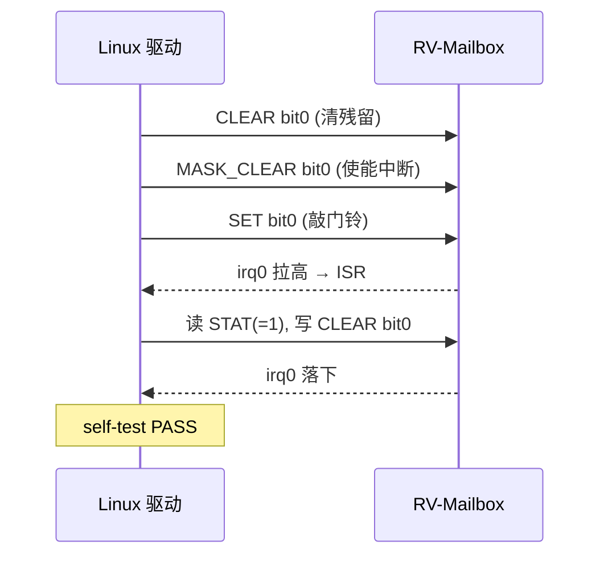
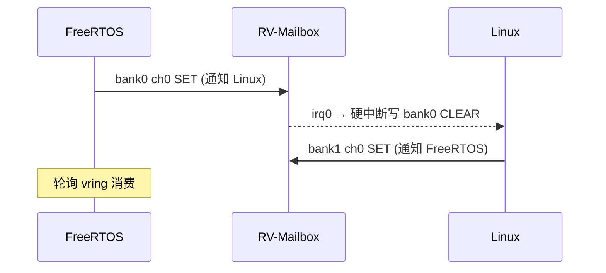

# RV-Mailbox —— QEMU RISC-V 平台通用邮箱设备及驱动软件 V1.0
## 软件设计说明书（软件著作权登记附件）

---

| 项目 | 内容 |
|---|---|
| 软件全称 | RV-Mailbox —— QEMU RISC-V 平台通用邮箱设备及驱动软件 |
| 软件简称 | RV-Mailbox |
| 版本号 | V1.0（IP 修订号 REVISION = 0x0100） |
| 开发完成日期 | 2026 年 6 月 |
| 开发语言 | C 语言 |
| 运行平台 | QEMU RISC-V 64 位（适用于 `virt`、`quard-star` 等任意 RISC-V 机器） |
| 文档版本 | 2.0 |

> **自主开发声明**：本软件参考了业界典型邮箱 IP（ARM MHU v1/v2）的**寄存器编程范式**（SET/CLEAR/STAT + MASK）的设计思想，但**全部代码由开发者自主设计与编写，与 ARM MHU 及任何第三方的源代码、RTL 无复制或衍生关系**。本说明书描述的是开发者独立实现的代码表达。

---

## 目录

1. 软件概述（含开发背景：填补 QEMU RISC-V 无邮箱设备的空白）
2. 通用性与可移植性设计
3. 运行环境
4. RV-Mailbox 设备设计（核心：寄存器手册）
5. 软件模块详细设计
6. 关键工作流程
7. 在 QEMU `virt` 标准机器上的适配与验证
8. 在 `quard-star` AMP 机器上的应用（典型用例）
9. 关键技术与创新点
10. 编译、部署与运行
11. 附录（寄存器速查表 / 缩略语 / 源文件清单）

---

## 1. 软件概述

### 1.1 软件简介

RV-Mailbox 是一款面向 **QEMU RISC-V 虚拟化平台**的**通用邮箱（Mailbox）设备及其配套驱动软件**。它以 QEMU 设备模型的形式实现了一个**机器无关**的多通道 doorbell（门铃）邮箱控制器，可挂载到任意 QEMU RISC-V 机器（标准 `virt`、自定义 `quard-star` 等），为运行在不同处理器核/不同特权域之间的软件提供**硬件级的跨核中断通知原语**；并随附 Linux 与 FreeRTOS 两侧的驱动软件，在门铃之上可进一步承载 VirtIO/RPMsg 消息通道。

### 1.2 开发背景与目的（核心定位）

**问题**：QEMU 的 RISC-V 机器模型（尤其是使用最广泛的标准 `virt` 机器）长期**缺少邮箱 / 跨核通信（IPC doorbell）设备**。在 ARM 平台上，`virt` 机器早已内置类似 MHU/IPI 的跨核通知机制可供软件开发与验证；而 RISC-V 侧的研究者若要开发与验证"核间/域间通过门铃中断 + 共享内存通信"的软件（AMP、TEE、remoteproc/RPMsg、virtio-backend 等），在 QEMU 上**没有现成的标准邮箱设备可用**，只能各自临时拼凑、彼此不通用。

**本软件的目的**：填补这一空白——提供一个**设计规范、机器无关、可复用**的 RISC-V 邮箱设备模型，使任何 QEMU RISC-V 机器都能简单挂载并立即获得"多通道可屏蔽门铃中断"能力，并给出 Linux/FreeRTOS 两侧可直接使用的驱动与端到端通信范例。

### 1.3 主要功能

1. **机器无关的设备模型**：标准 QEMU `SysBusDevice`，仅暴露 1 个 MMIO 区与 2 根中断线，任何机器只需分配基址、路由中断即可接入。
2. **多通道门铃通知**：两个方向（bank0 / bank1）各 3 个独立 32 位通道，可承载多达 96 个/方向的独立事件位。
3. **W1S/W1C 原子读写语义**：发送方"写 1 置位"，接收方"写 1 清位"，无锁并发安全。
4. **可屏蔽中断与电平合并**：每事件位独立可屏蔽；同方向多通道有效事件合并为一根电平中断线。
5. **设备自描述**：REVISION / NUM_CHANNELS / NUM_BANKS 只读寄存器，驱动运行时探测能力。
6. **配套驱动软件**：
   - Linux 自测平台驱动（在标准 `virt` 上一键验证门铃 + 中断）；
   - Linux `remoteproc` 驱动（承载 VirtIO/RPMsg）；
   - FreeRTOS 侧轻量 RPMsg 收发实现。
7. **可移植性已验证**：同一设备在标准 `virt`（单 OS 自测）与 `quard-star`（AMP 双 OS rpmsg 双向）两种机器上均验证通过。

---

## 2. 通用性与可移植性设计

RV-Mailbox 的核心设计目标是"**一次实现、任意 RISC-V 机器复用**"，为此做了如下解耦：

- **设备身份与机器解耦**：QOM 类型名为中性的 `"riscv.mailbox"`（`TYPE_RISCV_MAILBOX`），源文件 `hw/riscv/riscv_mailbox.c`，不依赖任何具体机器的头文件或常量。
- **资源最小暴露**：设备只 `sysbus_init_mmio()` 一个 4KB MMIO 区、`sysbus_init_irq()` 两根中断线。基址、中断号、中断目标（PLIC/APLIC/IMSIC）全部由挂载它的机器决定。
- **无条件编译**：在 `hw/riscv/meson.build` 中无条件加入构建，任何启用的 RISC-V 机器都能引用 `TYPE_RISCV_MAILBOX`。
- **设备树友好**：约定 `compatible = "qemu,riscv-mailbox"`，机器生成 FDT 节点后，Linux 平台驱动即可自动匹配 probe。

**接入一台新机器仅需三步**（以标准 `virt` 为例，见 §7）：① memmap 加一项基址；② 创建设备并 `memory_region_add_subregion` + `sysbus_connect_irq` 到该机器的中断控制器；③ 生成一个 `compatible="qemu,riscv-mailbox"` 的 FDT 节点。

---

## 3. 运行环境

### 3.1 软件环境

| 组件 | 版本 |
|---|---|
| 虚拟样机 | QEMU 8.0.2（设备可移植到任意支持的 QEMU 版本） |
| 通用操作系统 | Linux 内核 v6.10 |
| 实时操作系统 | FreeRTOS（AMP 场景可信域固件） |
| 交叉工具链 | GCC 15.2.0（riscv64-unknown-linux-gnu / -elf） |
| 构建宿主 | Ubuntu 24.04（WSL2） |

### 3.2 设备资源占用

| 资源 | 规格 |
|---|---|
| MMIO 区 | 4 KB（`0x1000`），基址由机器分配（`virt` 上为 `0x102000`） |
| 中断线 | 2 根（bank0 / bank1），由机器路由到 PLIC/APLIC |

---

## 4. RV-Mailbox 设备设计（核心）

### 4.1 设计理念

采用"**双 bank × 多通道 × 32 位 doorbell**"的分层结构：

- **bank（方向）**：两个寄存器组对应两根独立中断线，典型用于"两个方向/两个目标 OS"的隔离，从硬件层杜绝同核回环误触发。
- **channel（通道）**：每 bank 内 3 个通道，可按优先级/业务类型分流（对齐 ARM MHU v1 经典 low/high/secure 三通道思想）。
- **doorbell（事件位）**：每通道 32 位，每位一个独立门铃事件。

### 4.2 寄存器地址空间布局

MMIO 总长 4 KB。两个 bank 的基址与通道步长：

| bank | 基址（相对） | 中断线 | 通道步长 |
|---|---|---|---|
| bank0 | `0x000` | irq0 | `0x20` |
| bank1 | `0x100` | irq1 | `0x20` |

通道地址 = bank 基址 + 通道号 × `0x20`（bank0: 0x000/0x020/0x040；bank1: 0x100/0x120/0x140）。

### 4.3 通道内寄存器手册

每通道 `0x20` 字节，6 个 32 位寄存器：

| 偏移 | 名称 | 访问 | 复位值 | 说明 |
|---|---|---|---|---|
| `+0x00` | `CHx_STAT` | RO | `0x0000_0000` | doorbell 状态，每位一个事件 |
| `+0x04` | `CHx_SET` | W1S | — | 写 1 置位 → 可能拉高中断（发送方写） |
| `+0x08` | `CHx_CLEAR` | W1C | — | 写 1 清位 → 全清后中断落下（接收方写） |
| `+0x0C` | `CHx_MASK_STAT` | RO | `0xFFFF_FFFF` | 中断屏蔽状态（1=屏蔽） |
| `+0x10` | `CHx_MASK_SET` | W1S | — | 写 1 置屏蔽位（关该位中断） |
| `+0x14` | `CHx_MASK_CLEAR` | W1C | — | 写 1 清屏蔽位（使能该位中断） |

> **W1S/W1C 语义**：发送/接收方各写独立寄存器，硬件按位 OR / AND-NOT 更新状态，天然规避读-改-写竞争——多核并发安全的关键。

### 4.4 设备级寄存器（自描述）

| 偏移 | 名称 | 访问 | 值 | 说明 |
|---|---|---|---|---|
| `0x0F0` | `REVISION` | RO | `0x0100` | IP 修订号，主.次版本 = v1.0 |
| `0x0F4` | `NUM_CHANNELS` | RO | `0x3` | 每 bank 通道数 |
| `0x0F8` | `NUM_BANKS` | RO | `0x2` | bank 数量 |

### 4.5 中断逻辑（电平合并）

```
irq0 = ( OR over ch∈{0,1,2} of ( STAT[bank0][ch] & ~MASK[bank0][ch] ) ) != 0
irq1 = ( OR over ch∈{0,1,2} of ( STAT[bank1][ch] & ~MASK[bank1][ch] ) ) != 0
```

电平触发；接收方写 `CLEAR` 清完相关位后中断自动落下；被 `MASK` 屏蔽的位不参与合并。

### 4.6 复位行为

复位时所有通道 `STAT=0`、`MASK=0xFFFF_FFFF`（**默认全屏蔽**），中断线拉低。接收方需显式 `MASK_CLEAR` 使能所关心的事件位（安全默认）。

---

## 5. 软件模块详细设计

### 5.1 QEMU 设备模型（`riscv_mailbox.c`）

机器无关的 `SysBusDevice`，QOM 类型 `"riscv.mailbox"`。核心状态：

```c
struct RISCVMailboxState {
    SysBusDevice parent_obj;
    MemoryRegion iomem;
    qemu_irq irq_linux;   /* bank0 中断线 */
    qemu_irq irq_rtos;    /* bank1 中断线 */
    uint32_t stat[RVMB_NUM_BANKS][RVMB_NUM_CHANNELS];  /* [bank][channel] */
    uint32_t mask[RVMB_NUM_BANKS][RVMB_NUM_CHANNELS];
};
```

- `qsmb_decode()`：MMIO 偏移 → (bank, channel, 寄存器)；
- `quard_star/riscv_mailbox_write()`：按 SET/CLEAR/MASK_* 更新并 `qsmb_update_irq()`；
- `qsmb_update_irq()`：按 §4.5 重算电平 `qemu_set_irq()`；
- `VMStateDescription`（version_id=1）持久化 stat/mask，支持快照迁移。

### 5.2 Linux 自测平台驱动（`rv_mailbox_selftest.c`）

匹配 `compatible="qemu,riscv-mailbox"`，probe 时自动完成自环测试：读 REVISION → request_irq → unmask bank0 ch0 bit0 → 写 SET 敲自己门铃 → ISR 读 STAT/写 CLEAR/唤醒完成量 → 判定 PASS。**用于在任意机器（尤其标准 `virt`）上一键证明设备工作正常**。

### 5.3 Linux remoteproc 驱动（`quard_star_rproc.c`）

AMP 场景下承载 VirtIO/RPMsg：kick 时写 bank1 ch0 SET 通知远端；硬中断写 bank0 ch0 CLEAR 应答；probe 时清并 unmask bank0 ch0 bit0。

### 5.4 FreeRTOS 侧 RPMsg（`simple_rpmsg.c`）

可信域侧轮询 vring 收，发送后写 bank0 ch0 SET 通知 Linux。寄存器访问宏按字节偏移寻址（避免 `uint32_t*` 指针运算 ×4）。

---

## 6. 关键工作流程

### 6.1 单机器自测（virt）：门铃自环



### 6.2 AMP 双 OS（quard-star）：跨域通知



---

## 7. 在 QEMU `virt` 标准机器上的适配与验证

### 7.1 适配改动（`hw/riscv/virt.c` / `virt.h`）

1. `virt_memmap[VIRT_MAILBOX] = { 0x102000, 0x1000 }`；
2. IRQ 号 `RV_MAILBOX_IRQ0=12 / RV_MAILBOX_IRQ1=13`；
3. `virt_machine_init` 中 `qdev_new(TYPE_RISCV_MAILBOX)` → 映射 MMIO + 两根中断接 mmio irqchip（PLIC/APLIC）；
4. `create_fdt_mailbox()` 生成 `compatible="qemu,riscv-mailbox"` 的设备树节点。

### 7.2 验证一：QEMU monitor 直接读设备寄存器（无需 guest）

```
(qemu) info mtree   →   0000000000102000-0000000000102fff (i/o): riscv.mailbox
(qemu) xp/1wx 0x1020f0  →  0x00000100   ; REVISION = v1.0
(qemu) xp/1wx 0x1020f4  →  0x00000003   ; NUM_CHANNELS
(qemu) xp/1wx 0x1020f8  →  0x00000002   ; NUM_BANKS
(qemu) xp/1wx 0x102000  →  0x00000000   ; STAT ch0 初始清零
```

证明：设备已在**标准 `virt` 机器**正确实例化并响应 MMIO 访问。

### 7.3 验证二：Linux 驱动在 virt 上自测（端到端）

启动 `qemu-system-riscv64 -M virt -kernel Image -drive rootfs ...`，`insmod rv_mailbox_selftest.ko` 后 dmesg：

```
rv_mailbox_selftest 102000.mailbox: RV-Mailbox @ 0x102000  REVISION=0x0100  NUM_CHANNELS=3  NUM_BANKS=2
rv_mailbox_selftest 102000.mailbox: registered IRQ 15
rv_mailbox_selftest 102000.mailbox: self-test: ringing doorbell (write SET bit0)...
rv_mailbox_selftest 102000.mailbox: self-test PASS: irq_count=1, STAT-in-ISR=0x1, STAT-after-clear=0x0
```

`/proc/interrupts`：
```
15:  1  ...  SiFive PLIC  12  Edge  rv_mailbox_selftest
```

证明：在标准 `virt` 上，设备树自动匹配驱动、门铃写入触发 PLIC 中断、ISR 正确读状态并清除——**SET→IRQ→STAT→CLEAR 全链路工作**。

---

## 8. 在 `quard-star` AMP 机器上的应用（典型用例）

同一 RV-Mailbox 设备挂载到自定义 `quard-star` 8 核机器（Hart7=FreeRTOS，Hart0–6=Linux），bank0/irq0→Linux(PLIC 50)、bank1/irq1→FreeRTOS(PLIC 51)，在门铃之上承载 Linux `remoteproc`+`virtio_rpmsg_bus` 与 FreeRTOS `simple_rpmsg` 的双向 RPMsg 通道。

**验证结果**：OpenAMP 双向通信测试 `BIDIRECTIONAL: PASS`（7/7），Linux 发出 `QUARDSTAR_PING_42`，FreeRTOS 接收并回显，Linux 完整收到。说明同一通用设备既能做"单机自测"，也能支撑完整的 AMP 双 OS 跨域通信。

---

## 9. 关键技术与创新点

1. **填补 QEMU RISC-V 平台空白**：首个机器无关、可复用的 RISC-V QEMU 邮箱/门铃 IPC 设备模型。
2. **方向隔离的双 bank 结构** + **多通道 32 位 doorbell 细粒度事件空间**（单方向 96 事件）。
3. **W1S/W1C + RO 镜像的无锁并发模型**：跨核无需自旋锁安全通知。
4. **可屏蔽 + 电平合并中断**：按位开关、临界区屏蔽、避免边沿丢失。
5. **设备自描述寄存器**：运行时探测能力，前后兼容。
6. **安全默认（复位全屏蔽）**：规避就绪前杂散中断。
7. **一处实现、多机复用、已双机验证**：standard `virt`（单 OS 自测）+ `quard-star`（AMP 双 OS rpmsg）。

---

## 10. 编译、部署与运行

```bash
./build.sh check      # 宿主依赖预检
./build.sh qemu       # 编译含 riscv.mailbox 设备的 QEMU（virt 与 quard-star 共用）
./build.sh driver     # 编译 Linux 驱动（含 rv_mailbox_selftest）
./build.sh all        # 全量构建

# 标准 virt 自测演示：
qemu-system-riscv64 -M virt -m 1G -smp 4 -nographic \
  -kernel output/linux_kernel/Image \
  -drive file=output/rootfs/rootfs.img,format=raw,id=hd0 \
  -device virtio-blk-device,drive=hd0 \
  -append "root=/dev/vda2 rw console=ttyS0"
# 进入 shell 后： insmod /root/rv_mailbox_selftest.ko ; dmesg | tail

# quard-star AMP 演示：
./run.sh
```

---

## 11. 附录

### 附录 A：寄存器速查表（bank 内偏移）

| 偏移 | 寄存器 | 访问 | 用途 |
|---|---|---|---|
| `0x00` | STAT | RO | doorbell 状态 |
| `0x04` | SET | W1S | 置门铃（发送方） |
| `0x08` | CLEAR | W1C | 清门铃（接收方） |
| `0x0C` | MASK_STAT | RO | 屏蔽状态 |
| `0x10` | MASK_SET | W1S | 关该位中断 |
| `0x14` | MASK_CLEAR | W1C | 开该位中断 |
| `0xF0` | REVISION | RO | `0x0100` |
| `0xF4` | NUM_CHANNELS | RO | `0x3` |
| `0xF8` | NUM_BANKS | RO | `0x2` |

### 附录 B：缩略语

| 缩写 | 全称 |
|---|---|
| AMP | Asymmetric Multi-Processing 非对称多处理 |
| MMIO | Memory-Mapped I/O |
| PLIC / APLIC | (Advanced) Platform-Level Interrupt Controller |
| W1S / W1C | Write-1-to-Set / Write-1-to-Clear |
| RPMsg | Remote Processor Messaging |
| FDT | Flattened Device Tree |
| QOM | QEMU Object Model |

### 附录 C：源文件清单

| 文件 | 说明 |
|---|---|
| `hw/riscv/riscv_mailbox.c` | QEMU 通用 RISC-V 邮箱设备模型 |
| `include/hw/riscv/riscv_mailbox.h` | 设备头（寄存器布局/状态结构） |
| `hw/riscv/virt.c` / `virt.h` | 标准 virt 机器接入 RV-Mailbox 的改动 |
| `rv_mailbox_selftest.c` | Linux 自测平台驱动（virt 演示） |
| `quard_star_rproc.c/.h` | Linux remoteproc 驱动（AMP 承载 RPMsg） |
| `mailbox_test.c` | Linux 邮箱中断测试驱动 |
| `simple_rpmsg.c` | FreeRTOS 侧轻量 RPMsg 收发 |
| `hwspecs.h` | 可信域寄存器偏移 |

---

*本文档为 RV-Mailbox V1.0 软件著作权登记申请的设计说明附件。文中所述软件由开发者独立设计实现，享有完整著作权。*
