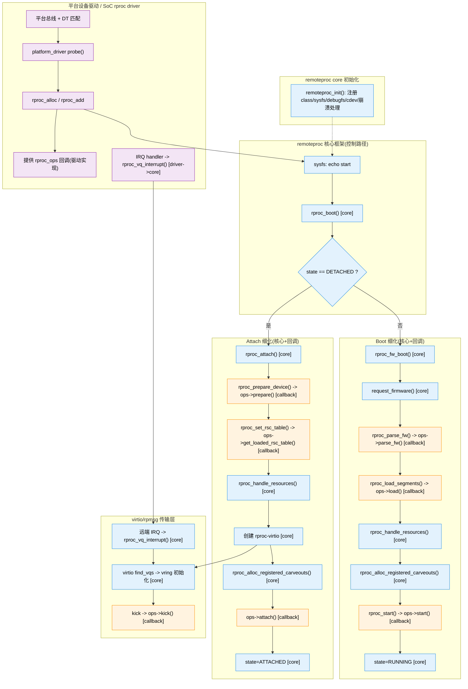

# Quard Star Remoteproc / RPMsg / Mailbox 关系图（思维导图风格）

下面使用 Mermaid 画出结构体与调用关系。你可以在支持 Mermaid 的编辑器中直接渲染。

### 速读说明
- `pdev` 是平台设备对象，包含硬件资源；`dev` 是通用设备基类。
- `priv` 是驱动私有结构体，挂在 `pdev` 上。
- `rproc_ops` 是 remoteproc 核心回调表（prepare/kick/get_loaded_rsc_table 等）。
- `resource_table` 在共享内存，Linux attach 会解析 `fw_rsc_vdev` 和 `fw_rsc_vdev_vring`。
- `Mailbox -> PLIC -> IRQ -> rproc_vq_interrupt` 是 doorbell 中断链路。
- `reserved-memory` 为 rpmsg buffer 池提供 DMA 可见内存。

